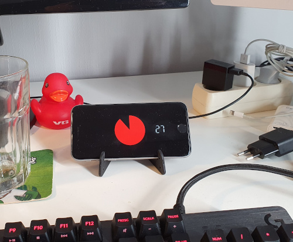

# zone

Stay in the zone and take regular breaks guided by this visual countdown!

https://lysebo.xyz/tools/zone

  

The countdown is visualized by a pie chart and a section with the number of remaining minutes.

When the time is up the screen turns green.

Click/tap the green screen to restart timer.

On wide screens the digits are positioned to the right of the pie chart. On tall screens the digits are centered under the pie chart.

v1 has a fixed interval of 30 minutes. Planning on expanding this with a config section.
